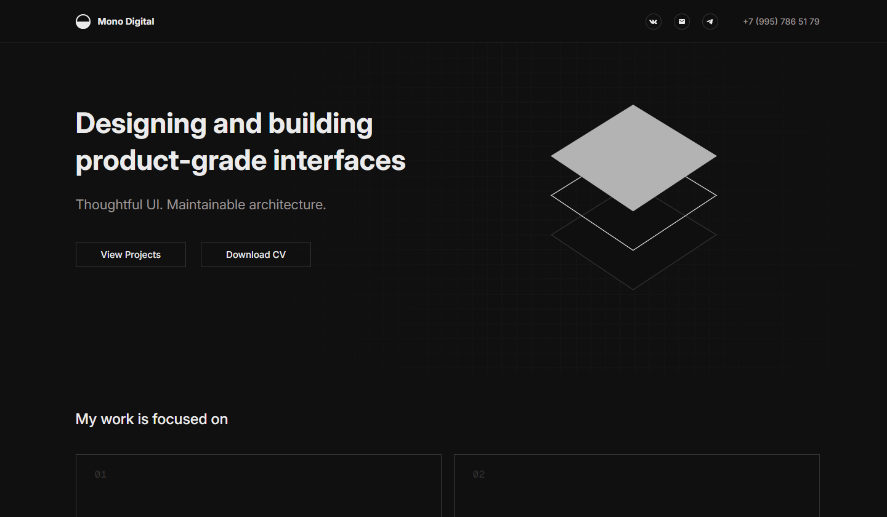

# Mono Digital — Portfolio Landing

Современный адаптивный лендинг-портфолио для frontend-разработчика.  
Проект разработан с акцентом на чистую верстку, плавные анимации и интерфейсы уровня продукта.

## ✨ О проекте

Это полностью адаптивный лендинг, демонстрирующий навыки frontend-разработки, реализованные кейсы и ключевые компетенции.

Основная цель — создать минималистичный, но выразительный интерфейс с акцентом на:

- кроссбраузерность верстки
- производительность
- плавные анимации
- масштабируемость стилей и компонентов

## 🚀 Стек технологий

- **Vite** — быстрый сборщик и dev-сервер
- **Tailwind CSS** — utility-first подход к стилям
- **Swiper** — слайдер с поддержкой touch-жестов
- **GSAP** — высокопроизводительные анимации

## 📸 Превью



## 🌐 Live Demo

👉 https://mono-digital.ru/

## 📦 Возможности

- Полностью адаптивная верстка (от мобильных до десктопов)
- Чистая и структурированная разметка
- Плавные анимации и переходы (GSAP)
- Интерактивный слайдер проектов (Swiper)
- Оптимизированные ассеты и упор на производительность

## 🛠 Установка и запуск

```bash
# установка зависимостей
npm install

# запуск dev-сервера
npm run dev

# сборка проекта
npm run build
```

### 🧠 Примечание

Проект задуман как часть персонального бренда и позиционируется скорее как сайт небольшой digital-студии, а не просто портфолио.

### 📄 Лицензия

MIT

## 📬 Контакты

Открыт для сотрудничества, фриланс-проектов и интересных задач.

- Email: hotalert@vk.com
- Telegram: @juicyblob
